# Jenkins
Introduction to Jenkins. 

## Steps for CI pipeline Setup 

- Jenkins Server

- Nexus Server

- Sonarqube Server 

- Security group

- Install necessary plugins

- Integrate 
  - nexus
  - Sonarqube with Jenkins

- Write and execute pipeline script

- Set notification

## 

### Jenkins Server

[Jenkins user documentation](https://www.jenkins.io/doc/)


- Launch an Ec2 Instance
  - Ubuntu 20.04 LTS
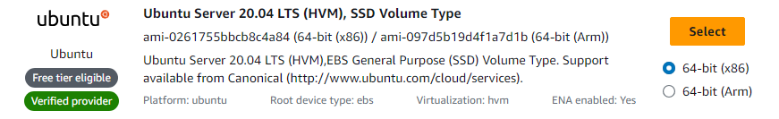

- Instance type
  - t2-small

- Keypair

- Security Group rules
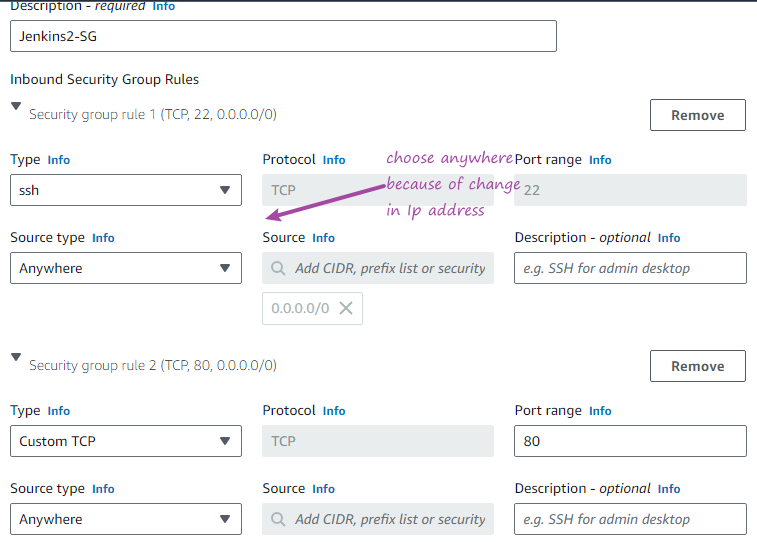

- Launch instance

- Connect to instance 
  - Run the following commands as root


```
sudo apt update

sudo apt install openjdk-11-jdk -y

curl -fsSL https://pkg.jenkins.io/debian-stable/jenkins.io-2023.key | sudo tee \
  /usr/share/keyrings/jenkins-keyring.asc > /dev/null


echo deb [signed-by=/usr/share/keyrings/jenkins-keyring.asc] \
  https://pkg.jenkins.io/debian-stable binary/ | sudo tee \
  /etc/apt/sources.list.d/jenkins.list > /dev/null

sudo apt-get update

sudo apt-get install jenkins -y

```
- Check the status of jenkins

`systemctl status jenkins`

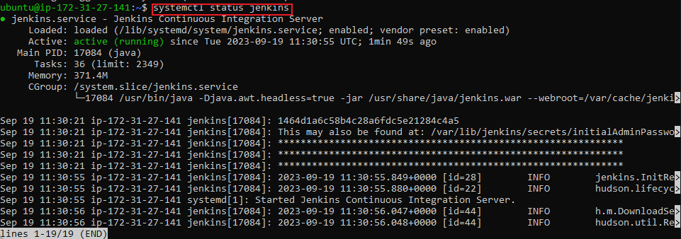

- The home directory of jenkins is in `/var/lib/jenkins`

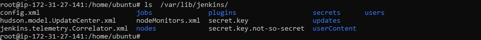

- There is a jenkins user called Jenkins
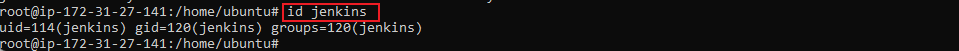

- Take public IP:8080 of Jenkins server to start to work with 

I had an error at this point.
Security group port for jenkins was set to 80 instead of 8080. 

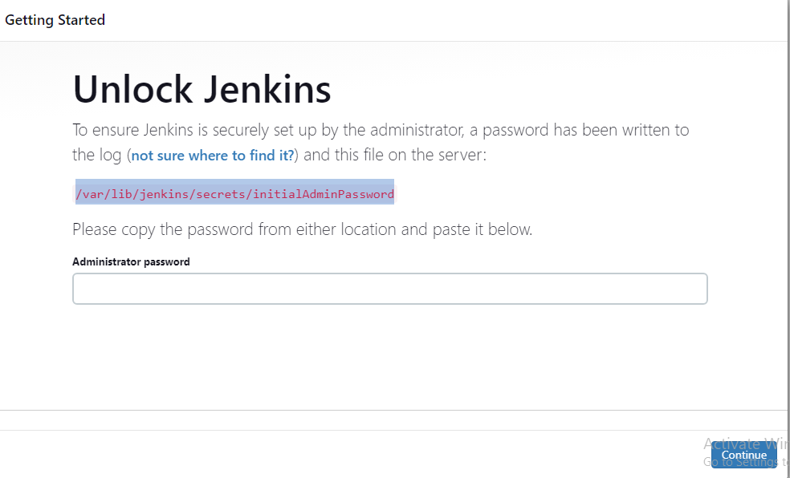

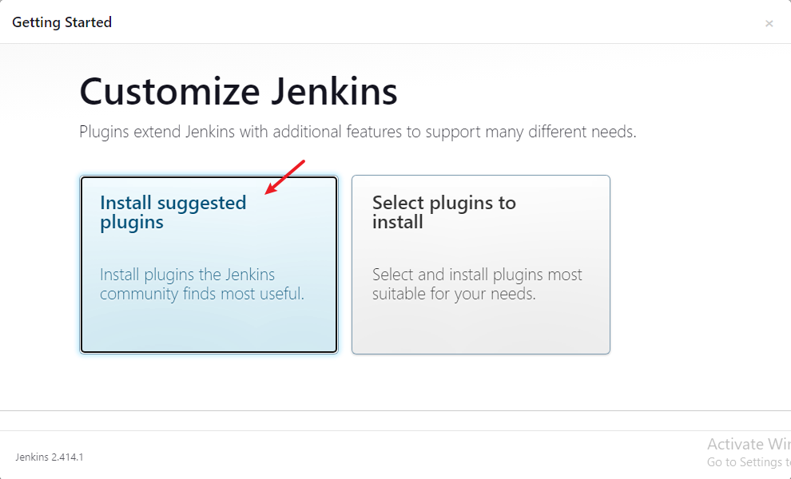

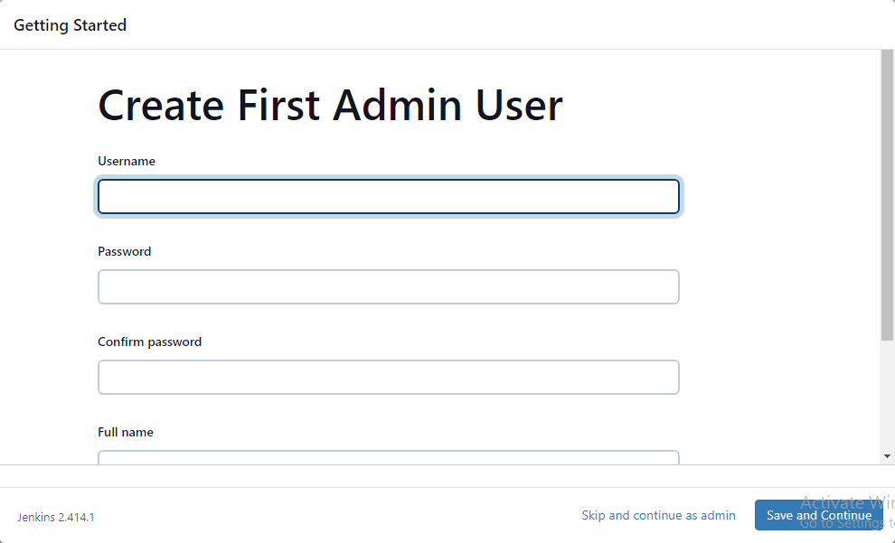

After creating an admin user  Save and finish  and proceed to Jenkins dashboard

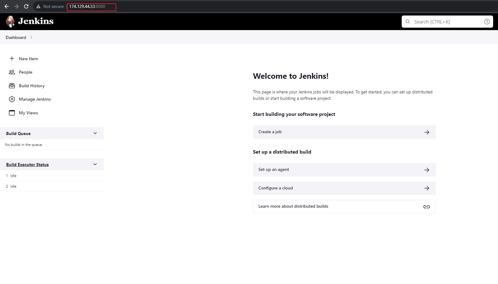

Install node.js plugin


### Install Tools in Jenkins

- Click Manage Jenkins (This is administrative page of Jenkins, only admin user will have access)

- Click on Tools (The tools there are few because they have plugins if you need more tools then you have to install plugins)

- Click add Jdk
  - name - OracleJDK11
  - Java_Home - java path when you connect to Jenkins server
  - ls /usr/lib/jvm/ home directory of jdk on jenkins

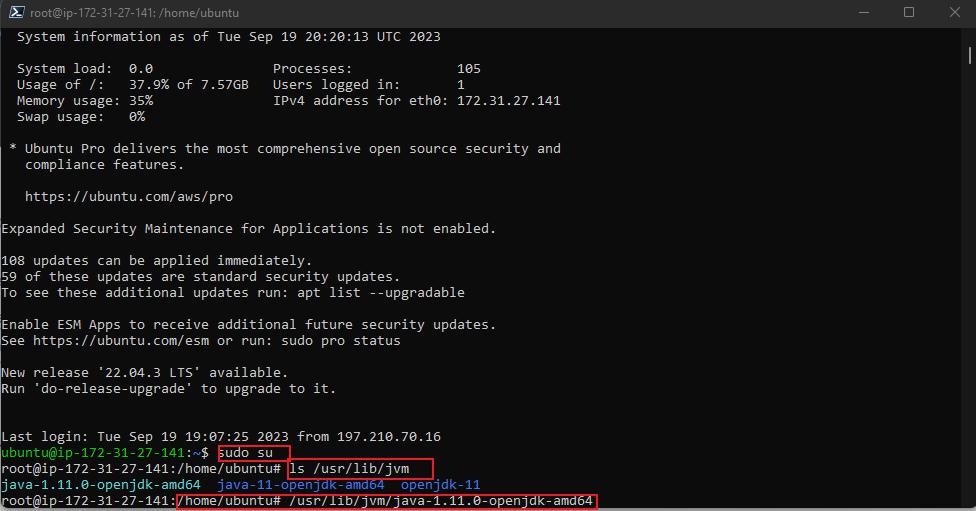  

- Click add java again
   - name - OracleJDK8(we do not have that on th server so we will install it)
   - As root run `apt update`
   - `apt upgrade`
   - `apt install openjdk-8-jdk -y`

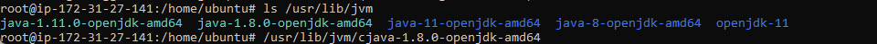

- Jenkins UI
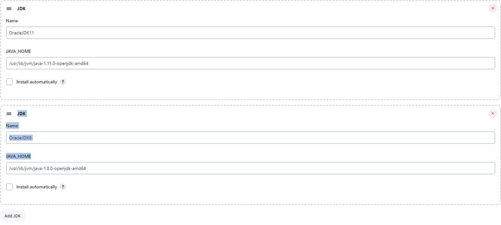

- Maven Tool
  - add the Maven tool
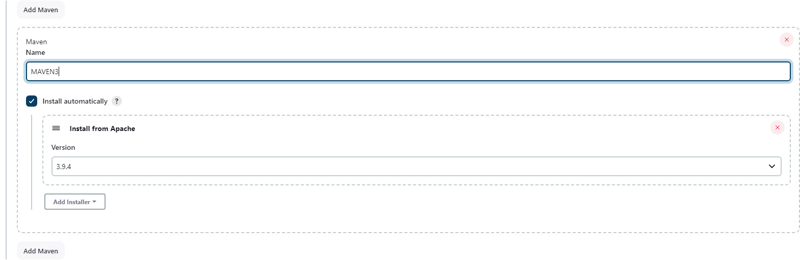

- We would have added the git tool but by default, git is already installed in ubuntu. 
- Other distros will have us installing git with the yum package manager.


## Create New Job in Jenkins

There are two types of Jobs in Jenkins, a freestyle project and also pipeline as code.

***A freestyle project*** in Jenkins is a type of project that allows you to build, test, and deploy software using a variety of different options and configurations. You can use freestyle projects to implement simple jobs, such as building and testing a project, or more complex jobs, such as deploying a project to multiple environments.


***A pipeline as a code*** project is a type of project that uses code to define the build, test, and deployment process. This allows you to version control your pipeline and make changes to it in a controlled manner. Pipeline as a code projects are typically more complex to set up than freestyle projects, but they offer more flexibility and control.

Here is a comparison of freestyle projects and pipeline as a code projects:

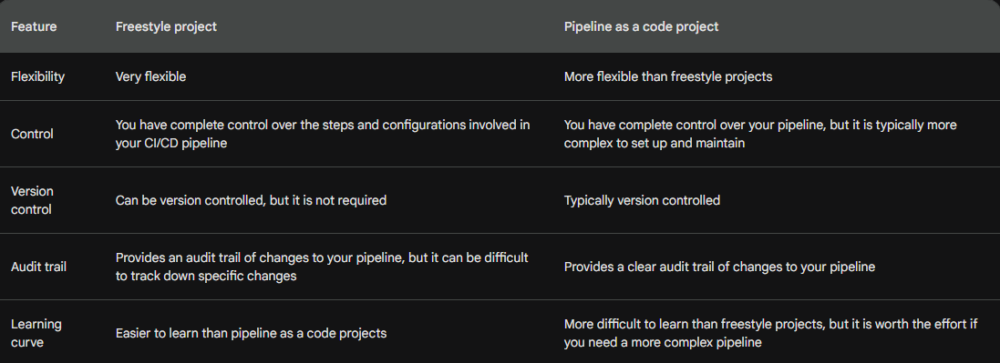

Which type of project should you use?

If you are new to CI/CD or you need a simple pipeline, then a freestyle project is a good option. However, if you need a more complex pipeline or you want to version control your pipeline, then a pipeline as a code project is a better option.

### Examples of freestyle projects

- Building and testing a Java project
- Deploying a static website to a web server
- Running a shell script to perform a specific task

### Examples of pipeline as a code projects

- Building and testing a microservices architecture
- Deploying a web application to multiple environments
- Running a complex pipeline that includes multiple steps, such as building, testing, - - - - - linting, and deploying

How to get started with pipeline as a code projects

If you are interested in getting started with pipeline as a code projects, there are a few things you need to do:

- Choose a pipeline as a code tool. There are a number of different tools available, such as Jenkins Pipeline, CircleCI, and GitHub Actions.

- Create a pipeline file. This file will define the steps in your pipeline and the tools that you will use.

- Store your pipeline file in a version control system. This will allow you to version control your pipeline and make changes to it in a controlled manner.

- Configure your pipeline as a code tool to use your pipeline file.

- Start running your pipeline!

   ### creating a freestyle job to run a shell script

- On Jenkins dashboard click on new item
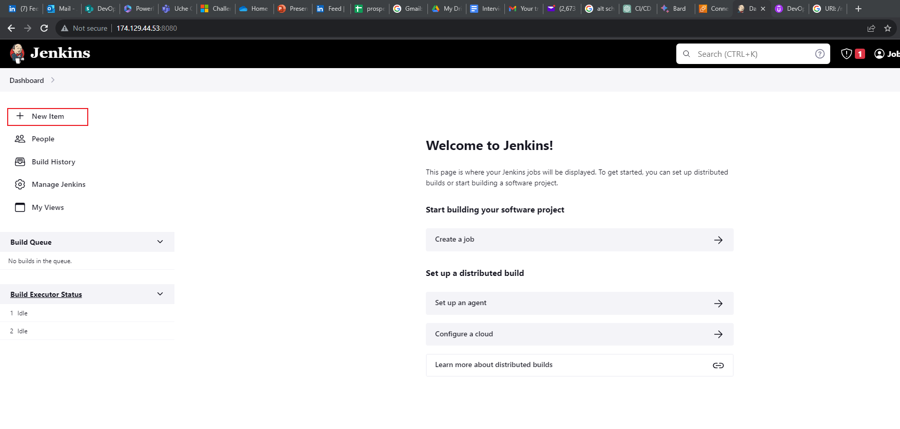

- Enter item name 
- Click on freestyle project
- click ok
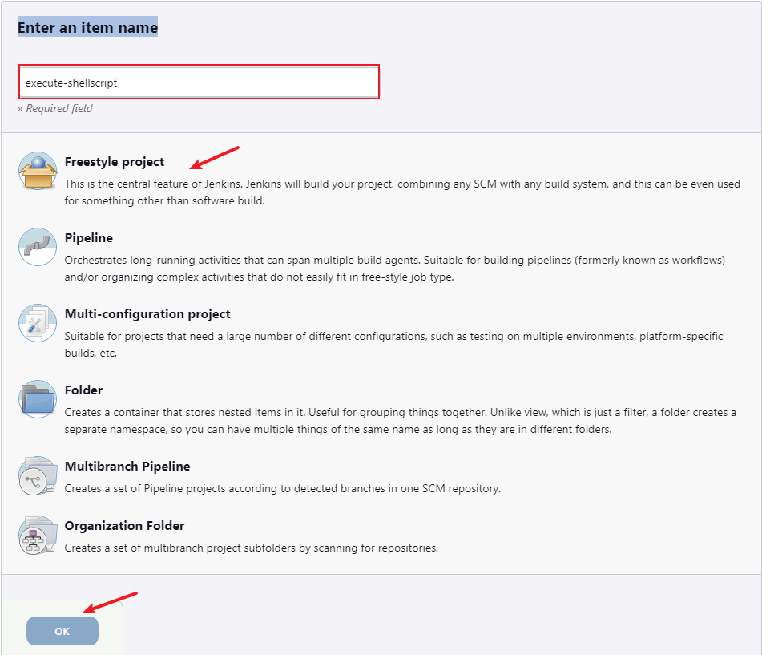

- Write a description 

- Under build steps 
- Add build steps
  - execute shell 

- write your commands
- Save
- Go back to the dashboard
- Click into your 
- Click build now
If you see this output, then you have successfully done your first build.

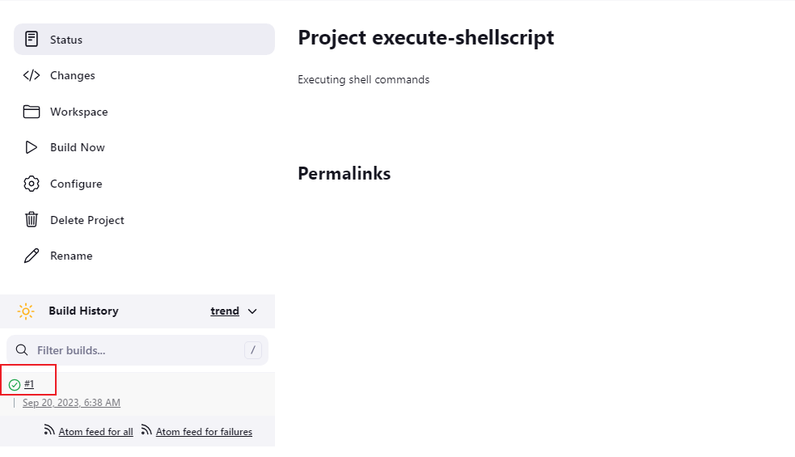

You can checkt the console output for sucess or otherwise of your job
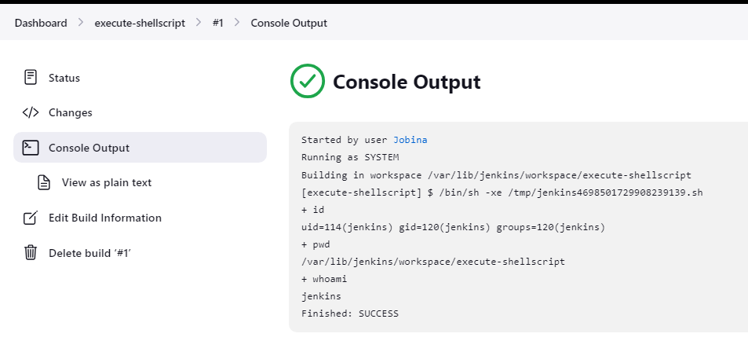

### Creating a freestyle build job with artifacts 
[Check here](https://github.com/Jobijollof/DevOps-Projects/tree/main/Project%209%20Introduction%20to%20Jenkins)


### Setting up a Pipeline using Jenkins, Sonarqube and Nexus


- Jenkinsfile  defines the stages in CI/CD pipeline

- Jenkinsfile is a text file with pipeline DSL (domain specific language) syntax

-  Similar to groovy but you do not have to understand or write groovy to understand or write a Jenkinsfile.

- Jenkinsfile has two syntax
  - Scripted 
  - Declarative

- Scripted is outdated now Declarative is the way forward now.


## Pipeline Concepts

- Pipeline is the main block of code

  - Jenkins will execute everything within that block
  - node/agent (you can define where the pipeline will be executed on which node or which agent)

- stages define the different stages of the pipeline, such as Build, Test, and Deploy.
Each stage contains specific steps that should be executed for that stage.
  - in stage you have step (eg maven install or git pull or upload artifact or any steps you want to execute from your pipeline)

- The post block defines actions to be taken after the pipeline run, such as notifications or clean-up actions.
### Sample Code  

```
pipeline {
    agent any  // Run on any available agent (Jenkins slave/agent)
    
    stages {
        stage('Build') {
            steps {
                echo 'Building the application...'
                // Add build commands here (e.g., compile code, package application)
            }
        }
        
        stage('Test') {
            steps {
                echo 'Running tests...'
                // Add test commands here (e.g., run unit tests, integration tests)
            }
        }
        
        stage('Deploy') {
            steps {
                echo 'Deploying the application...'
                // Add deployment commands here (e.g., deploy to a server)
            }
        }
    }
    
    post {
        always {
            // Clean up, notifications, or other actions to be performed regardless of the build result
        }
        success {
            echo 'Pipeline executed successfully!'
        }
        failure {
            echo 'Pipeline failed!'
        }
    }
}

```

In this example, we're echoing some messages to represent build, test, and deployment actions.  We are going to replace these with actual build, test, and deployment steps relevant to our project.

- Environment Variables:
Environment variables are specific to a stage or step and can be accessed using the environment block.

```
pipeline {
    agent any

    stages {
        stage('Example') {
            environment {
                ENV_VARIABLE = 'some value'
            }
            steps {
                echo "Environment variable value: ${ENV_VARIABLE}"
            }
        }
    }
}

```

We are going to write the pipeline to

- Fetch the code
- Build the code 
- Run some tests.

Pay attention to opening and closing of curly braces.

We already have a Jenkins Server set up we are going to set up Sonarqube and Nexus (both are going to be set up with user data script)

### Nexus server
- Launch Aws Ec2 Instance
- Centos 7 ami
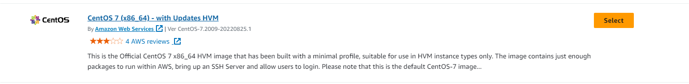
- Instance type

  - t2-medium
  
- Key pair

- Create Security group 
  - Nexus-SG
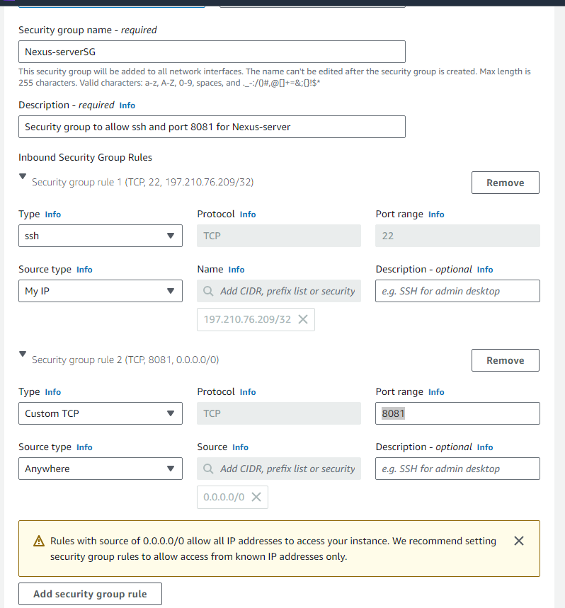
- Advanced settings 
  - User data script

```
#!/bin/bash
yum install java-1.8.0-openjdk.x86_64 wget -y   
mkdir -p /opt/nexus/   
mkdir -p /tmp/nexus/                           
cd /tmp/nexus/
NEXUSURL="https://download.sonatype.com/nexus/3/latest-unix.tar.gz"
wget $NEXUSURL -O nexus.tar.gz
sleep 10
EXTOUT=`tar xzvf nexus.tar.gz`
NEXUSDIR=`echo $EXTOUT | cut -d '/' -f1`
sleep 5
rm -rf /tmp/nexus/nexus.tar.gz
cp -r /tmp/nexus/* /opt/nexus/
sleep 5
useradd nexus
chown -R nexus.nexus /opt/nexus 
cat <<EOT>> /etc/systemd/system/nexus.service
[Unit]                                                                          
Description=nexus service                                                       
After=network.target                                                            
                                                                  
[Service]                                                                       
Type=forking                                                                    
LimitNOFILE=65536                                                               
ExecStart=/opt/nexus/$NEXUSDIR/bin/nexus start                                  
ExecStop=/opt/nexus/$NEXUSDIR/bin/nexus stop                                    
User=nexus                                                                      
Restart=on-abort                                                                
                                                                  
[Install]                                                                       
WantedBy=multi-user.target                                                      

EOT

echo 'run_as_user="nexus"' > /opt/nexus/$NEXUSDIR/bin/nexus.rc
systemctl daemon-reload
systemctl start nexus
systemctl enable nexus

```

- Launch Instance


### Sonar Server

Launch Instance

- Ami
  -  Ubuntu 20.04 free tier eligible
- Instance type
  - t2.medium
- Security group
  - port 22-ssh
  - port 80 (we have Nginx running. We can connect and also Jenkins can connect)
- Keypair
- Advanced setting
   - User data

 ```
#!/bin/bash
cp /etc/sysctl.conf /root/sysctl.conf_backup
cat <<EOT> /etc/sysctl.conf
vm.max_map_count=262144
fs.file-max=65536
ulimit -n 65536
ulimit -u 4096
EOT
cp /etc/security/limits.conf /root/sec_limit.conf_backup
cat <<EOT> /etc/security/limits.conf
sonarqube   -   nofile   65536
sonarqube   -   nproc    409
EOT

sudo apt-get update -y
sudo apt-get install openjdk-11-jdk -y
sudo update-alternatives --config java

java -version

sudo apt update
wget -q https://www.postgresql.org/media/keys/ACCC4CF8.asc -O - | sudo apt-key add -

sudo sh -c 'echo "deb http://apt.postgresql.org/pub/repos/apt/ `lsb_release -cs`-pgdg main" >> /etc/apt/sources.list.d/pgdg.list'
sudo apt install postgresql postgresql-contrib -y
#sudo -u postgres psql -c "SELECT version();"
sudo systemctl enable postgresql.service
sudo systemctl start  postgresql.service
sudo echo "postgres:admin123" | chpasswd
runuser -l postgres -c "createuser sonar"
sudo -i -u postgres psql -c "ALTER USER sonar WITH ENCRYPTED PASSWORD 'admin123';"
sudo -i -u postgres psql -c "CREATE DATABASE sonarqube OWNER sonar;"
sudo -i -u postgres psql -c "GRANT ALL PRIVILEGES ON DATABASE sonarqube to sonar;"
systemctl restart  postgresql
#systemctl status -l   postgresql
netstat -tulpena | grep postgres
sudo mkdir -p /sonarqube/
cd /sonarqube/
sudo curl -O https://binaries.sonarsource.com/Distribution/sonarqube/sonarqube-8.3.0.34182.zip
sudo apt-get install zip -y
sudo unzip -o sonarqube-8.3.0.34182.zip -d /opt/
sudo mv /opt/sonarqube-8.3.0.34182/ /opt/sonarqube
sudo groupadd sonar
sudo useradd -c "SonarQube - User" -d /opt/sonarqube/ -g sonar sonar
sudo chown sonar:sonar /opt/sonarqube/ -R
cp /opt/sonarqube/conf/sonar.properties /root/sonar.properties_backup
cat <<EOT> /opt/sonarqube/conf/sonar.properties
sonar.jdbc.username=sonar
sonar.jdbc.password=admin123
sonar.jdbc.url=jdbc:postgresql://localhost/sonarqube
sonar.web.host=0.0.0.0
sonar.web.port=9000
sonar.web.javaAdditionalOpts=-server
sonar.search.javaOpts=-Xmx512m -Xms512m -XX:+HeapDumpOnOutOfMemoryError
sonar.log.level=INFO
sonar.path.logs=logs
EOT

cat <<EOT> /etc/systemd/system/sonarqube.service
[Unit]
Description=SonarQube service
After=syslog.target network.target

[Service]
Type=forking

ExecStart=/opt/sonarqube/bin/linux-x86-64/sonar.sh start
ExecStop=/opt/sonarqube/bin/linux-x86-64/sonar.sh stop

User=sonar
Group=sonar
Restart=always

LimitNOFILE=65536
LimitNPROC=4096


[Install]
WantedBy=multi-user.target
EOT

systemctl daemon-reload
systemctl enable sonarqube.service
#systemctl start sonarqube.service
#systemctl status -l sonarqube.service
apt-get install nginx -y
rm -rf /etc/nginx/sites-enabled/default
rm -rf /etc/nginx/sites-available/default
cat <<EOT> /etc/nginx/sites-available/sonarqube
server{
    listen      80;
    server_name sonarqube.groophy.in;

    access_log  /var/log/nginx/sonar.access.log;
    error_log   /var/log/nginx/sonar.error.log;

    proxy_buffers 16 64k;
    proxy_buffer_size 128k;

    location / {
        proxy_pass  http://127.0.0.1:9000;
        proxy_next_upstream error timeout invalid_header http_500 http_502 http_503 http_504;
        proxy_redirect off;
              
        proxy_set_header    Host            \$host;
        proxy_set_header    X-Real-IP       \$remote_addr;
        proxy_set_header    X-Forwarded-For \$proxy_add_x_forwarded_for;
        proxy_set_header    X-Forwarded-Proto http;
    }
}
EOT
ln -s /etc/nginx/sites-available/sonarqube /etc/nginx/sites-enabled/sonarqube
systemctl enable nginx.service
#systemctl restart nginx.service
sudo ufw allow 80,9000,9001/tcp

echo "System reboot in 30 sec"
sleep 30
reboot

```
- Collect the public ip of the Nexus server and open Sonartype Nexus Repository
  publicIP:8081
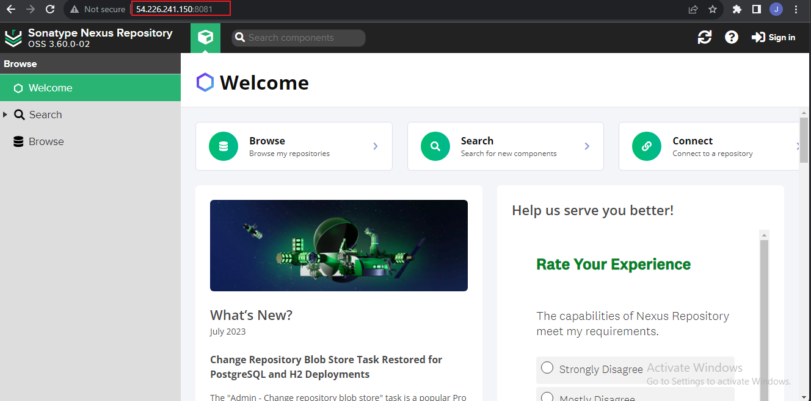

- Sign in
  - copy path for password

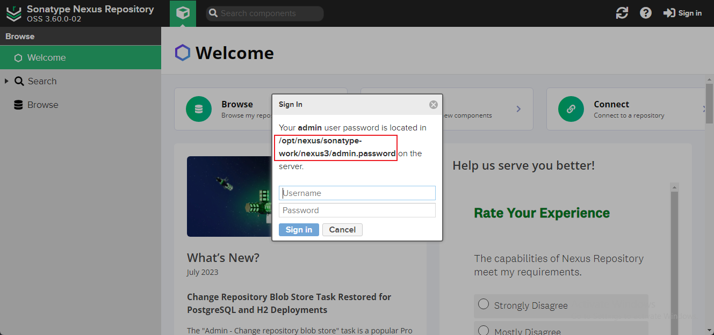

- ssh into Nexus server

`cat /opt/nexus/sonatype-work/nexus3/admin.password on the `


